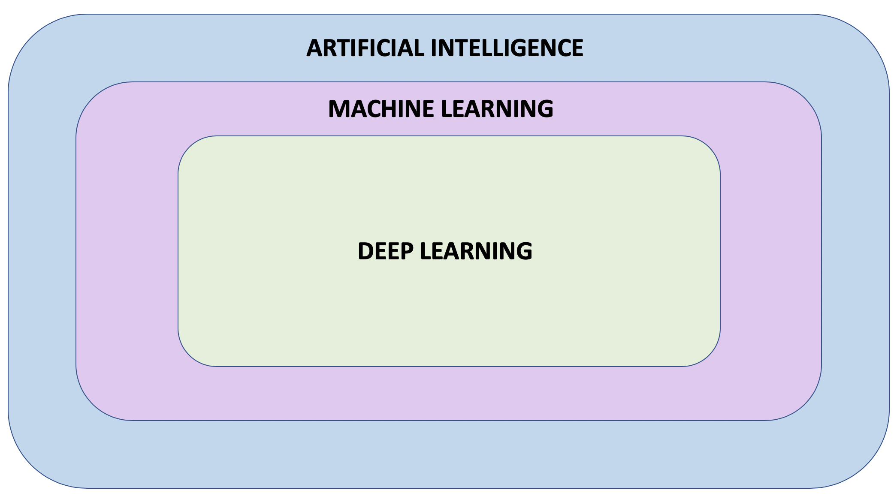
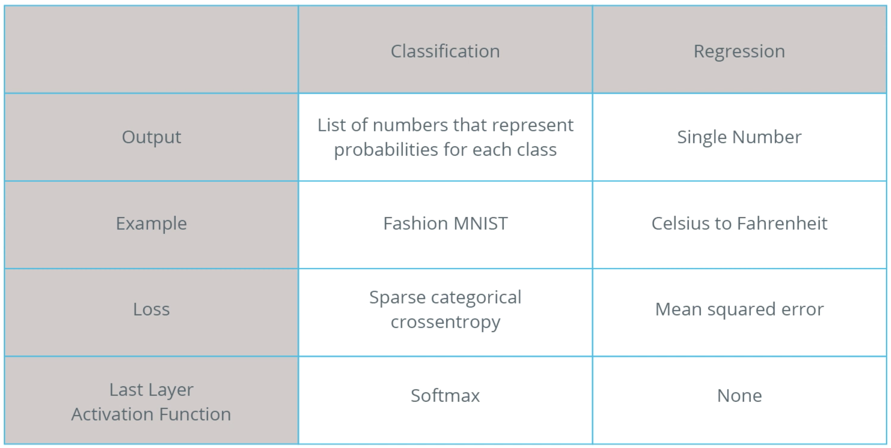

# Introduction
Machine Learning come across many different terms such as `artificial intelligence`, `machine learning`, `neural network`, and `deep learning`. But what do these terms actually mean and how do they relate to each other?

Below given a brief description of these terms:

**Artificial Intelligence:** A field of computer science that aims to make computers achieve human-style intelligence. There are many approaches to reaching this goal, including `machine learning` and `deep learning`.

**Machine Learning:** A set of related techniques in which computers are trained to perform a particular task rather than by explicitly programming them.

**Neural Network:** A construct in `Machine Learning` inspired by the network of neurons (nerve cells) in the biological brain. `Neural networks` are a fundamental part of `deep learning`.

**Deep Learning:** A subfield of `machine learning` that uses multi-layered neural networks. Often, “machine learning” and “deep learning” are used interchangeably.

**Machine learning** and **deep learning** also have many subfields, branches, and special techniques. A notable example of this diversity is the separation of **Supervised Learning** and **Unsupervised Learning**.

To over simplify — in supervised learning you know what you want to teach the computer, while unsupervised learning is about letting the computer figure out what can be learned. Supervised learning is the most common type of machine learning.

## Applications of Machine Learning
Coming soon......
## Prerequisites
Coming soon.....
#### - Introduction to Python

# Introduction to Machine Learning
## What is Machine Learning?
coming soon....

There are many types of neural network architectures. However, no matter what architecture you choose, the math it contains (what calculations are being performed, and in what order) is not modified during training. Instead, it is the internal variables (“weights” and “biases”) which are updated during training.

For example, in the Fahrenheit to Celsius conversion problem, the model starts by multiplying the input by some number (the weight) and adding another number (the bias). Training the model involves finding the right values for these variables, not changing from multiplication and addition to some other operation.

#### Fahrenheit to Celsius conversion problem
#### Celsius to Fahrenheit conversion problem

## Some key terms used in Machine Learning

- **Feature:** The input(s) to our model
- **Examples:** An input/output pair used for training
- **Labels:** The output of the model
- **Layer:** A collection of nodes connected together within a neural network.
- **Model:** The representation of your neural network
- **Dense and Fully Connected (FC):** Each node in one layer is connected to each node in the previous layer.
- **Weights and biases:** The internal variables of model
- **Loss:** The discrepancy between the desired output and the actual output
- **MSE:** Mean squared error, a type of loss function that counts a small number of large discrepancies as worse than a large number of small ones.
- **Gradient Descent:** An algorithm that changes the internal variables a bit at a time to gradually reduce the loss function.
- **Optimizer:** A specific implementation of the gradient descent algorithm. (There are many algorithm.e.g. the “Adam” Optimizer, which stands for ADAptive with Momentum. It is considered the best-practice optimizer.)
- **Learning rate:** The “step size” for loss improvement during gradient descent.
- **Batch:** The set of examples used during training of the neural network
- **Epoch:** A full pass over the entire training dataset
- **Forward pass:** The computation of output values from input
- **Backward pass (backpropagation):** The calculation of internal variable adjustments according to the optimizer algorithm, starting from the output layer and working back through each layer to the input.
- **Flattening:** The process of converting a 2d image into 1d vector
- **ReLU:** An activation function that allows a model to solve nonlinear problems
- **Softmax:** A function that provides probabilities for each possible output class
- **Classification:** A machine learning model used for distinguishing among two or more output categories

## Image Classification Fashion MNIST dataset
The Fashion MNIST dataset contains 70,000 greyscale images of clothing. We used 60,000 of them to train our network and 10,000 of them to test its performance. In order to feed these images into our neural network we had to flatten the 28 × 28 images into 1d vectors with 784 elements. Our network consisted of a fully connected layer with 128 units (neurons) and an output layer with 10 units, corresponding to the 10 output labels. These 10 outputs represent probabilities for each class. The softmax activation function calculated the probability distribution.

## Classifying Images of Clothing

#### The differences between regression and classification problems.
- **Regression:** A model that outputs a single value. For example, an estimate of a house’s value.
- **Classification:** A model that outputs a probability distribution across several categories. For example, in Fashion MNIST, the output was 10 probabilities, one for each of the different types of clothing.We use Softmax as the activation function in our last Dense layer to create this probability distribution.

## Introduction to CNN
coming soon....
#### Convolutions and max pooling.
A convolution is the process of applying a filter (“kernel”) to an image. Max pooling is the process of reducing the size of the image through downsampling.

Convolutional layers can be added to the neural network model using the `Conv2D` layer type in Keras. This layer is similar to the `Dense` layer, and has weights and biases that need to be tuned to the right values. The `Conv2D` layer also has kernels (filters) whose values need to be tuned as well. So, in a `Conv2D` layer the values inside the filter matrix are the variables that get tuned in order to produce the right output.

#### Some terms related to CNN:

- **CNNs:** Convolutional neural network. That is, a network which has at least one convolutional layer. A typical CNN also includes other types of layers, such as pooling layers and dense layers.
- **Convolution:** The process of applying a kernel (filter) to an image
- **Kernel / filter:** A matrix which is smaller than the input, used to transform the input into chunks
- **Padding:** Adding pixels of some value, usually 0, around the input image
- **Pooling** The process of reducing the size of an image through downsampling.There are several types of pooling layers. For example, average pooling converts many values into a single value by taking the average. However, maxpooling is the most common.
- **Maxpooling:** A pooling process in which many values are converted into a single value by taking the maximum value from among them.
- **Stride:** the number of pixels to slide the kernel (filter) across the image.
- **Downsampling:** The act of reducing the size of an image

### Image Classification with CNNs

## Techniques to Prevent Overfitting

Three different techniques to prevent overfitting:
- **Early Stopping:** In this method, we track the loss on the validation set during the training phase and use it to determine when to stop training such that the model is accurate but not overfitting.

- **Image Augmentation:** Artificially boosting the number of images in our training set by applying random image transformations to the existing images in the training set.

- **Dropout:** Removing a random selection of a fixed number of neurons in a neural network during training.

### CNNs with RGB Images of Different Sizes:

- **Resizing:** When working with images of different sizes, you must resize all the images to the same size so that they can be fed into a CNN.

- **Color Images:** Computers interpret color images as 3D arrays.
- **RGB Image:** Color image composed of 3 color channels: Red, Green, and Blue.
-**Convolutions:** When working with RGB images we convolve each color channel with its own convolutional filter. Convolutions on each color channel are performed in the same way as with grayscale images, i.e. by performing element-wise multiplication of the convolutional filter (kernel) and a section of the input array. The result of each convolution is added up together with a bias value to get the convoluted output.
- **Max Pooling:** When working with RGB images we perform max pooling on each color channel using the same window size and stride. Max pooling on each color channel is performed in the same way as with grayscale images, i.e. by selecting the max value in each window.
- **Validation Set:** We use a validation set to check how the model is doing during the training phase. Validation sets can be used to perform Early Stopping to prevent overfitting and can also be used to help us compare different models and choose the best one.
## Transfer Learning
- **Transfer Learning:** A technique that reuses a model that was created by machine learning experts and that has already been trained on a large dataset. When performing transfer learning we must always change the last layer of the pre-trained model so that it has the same number of classes that we have in the dataset we are working with.

- **Freezing Parameters:** Setting the variables of a pre-trained model to non-trainable. By freezing the parameters, we will ensure that only the variables of the last classification layer get trained, while the variables from the other layers of the pre-trained model are kept the same.

- **MobileNet:** A state-of-the-art convolutional neural network developed by Google that uses a very efficient neural network architecture that minimizes the amount of memory and computational resources needed, while maintaining a high level of accuracy. MobileNet is ideal for mobile devices that have limited memory and computational resources.
